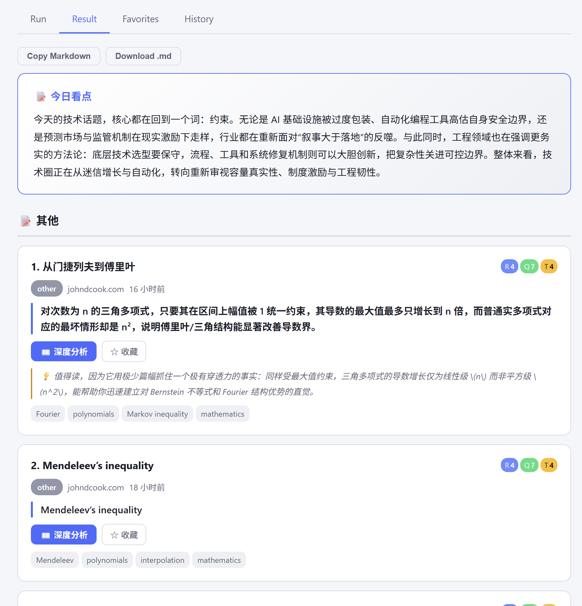
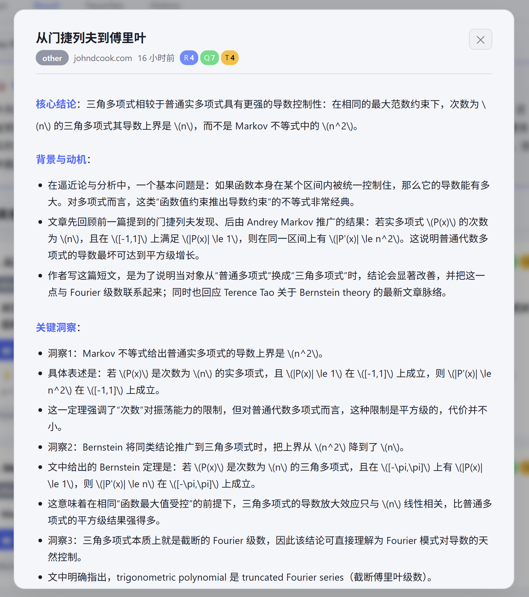
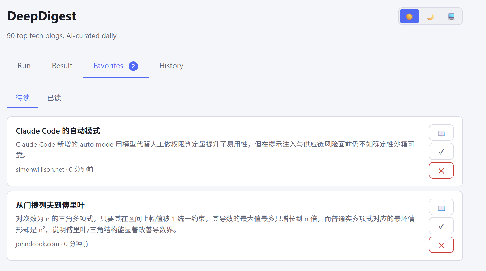
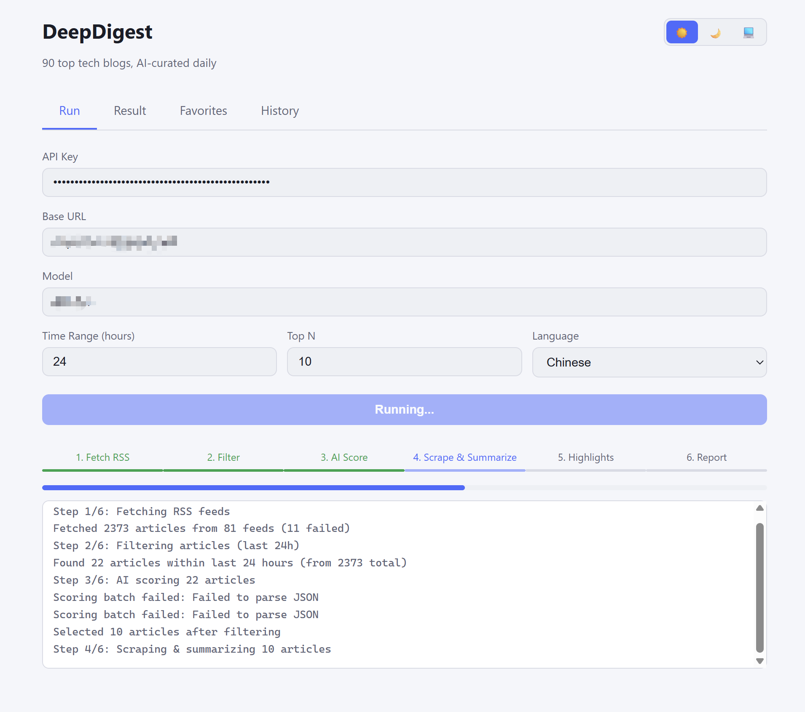

# DeepDigest

AI 驱动的技术博客每日深度分析工具。从 90+ 顶级技术博客中智能筛选文章，抓取全文，生成金字塔原理结构化深度分析，让你不打开原文也能掌握 80% 的核心内容。

## 截图

### 卡片式阅读主页
> 分类标签 · 三维评分 · 一句话结论 · 今日看点



### 深度分析弹窗
> 金字塔原理结构化分析 · 收藏 · 打开原文



### 收藏夹（待读管理）
> 待读 / 已读切换 · 快速回顾



### 运行流水线
> 6 步流水线 · 实时进度 · SSE 日志流



## 特性

### 智能筛选（不只是排序）

- **三维评分**：相关性(R)、质量(Q)、时效性(T) 独立评分，加权排序（R×0.4 + Q×0.4 + T×0.2）
- **底线淘汰**：质量 < 4 或相关性 < 3 的文章直接淘汰，不靠高分补偿低分
- **软配额**：同分类超过 5 篇自动降权，防止 AI 热点霸屏
- **跨界发现**：保留 1 个槽位给"低相关性但高质量"的文章，打破信息茧房

### 深度分析（不只是摘要）

- **全文抓取**：Puppeteer 无头浏览器抓取文章全文，不依赖 RSS 截断内容
- **金字塔原理**：结论先行 → 背景动机 → 关键洞察 → 创新独特性 → 局限反思
- **分层阅读**：一句话结论快速扫描，点击展开深度分析弹窗

### 阅读体验

- **卡片式 UI**：杂志风格布局，分类彩色标签，三维评分徽章
- **深度分析弹窗**：Markdown 渲染，结构化分析，点击遮罩关闭
- **收藏夹**：待读/已读管理，服务端持久化
- **深浅主题**：深色 / 浅色 / 跟随系统

## 快速开始

### 前置要求

- [Bun](https://bun.sh/) v1.0+
- Google Chrome（Puppeteer 用于全文抓取）
- OpenAI 兼容的 API Key

### 安装

```bash
git clone https://github.com/your-username/deep-digest.git
cd deep-digest
bun install
```

### 运行

```bash
bun run server.ts
```

打开 http://localhost:3000，填入 API Key 和 Base URL，点击 Run Digest。

### 配置

在 Web 界面中配置：

| 参数 | 说明 | 默认值 |
|------|------|--------|
| API Key | OpenAI 兼容的 API Key | - |
| Base URL | API 端点 | https://api.openai.com |
| Model | 模型名称 | gpt-4o-mini |
| Time Range | 抓取最近 N 小时的文章 | 48 |
| Top N | 精选文章数量 | 15 |
| Language | 摘要语言 | 中文 |

配置会自动保存到 `data/config.json`。

## 项目结构

```
server.ts              HTTP 路由 + SSE 事件流（入口）
src/
  types.ts             类型定义 + 常量
  config.ts            配置持久化
  feeds.ts             RSS 源定义 + 拉取解析
  scraper.ts           Puppeteer 全文抓取
  scoring.ts           AI 评分 + 智能筛选
  summarizer.ts        分层深度分析
  ai-client.ts         AI API 封装
  report.ts            Markdown 报告生成
public/
  index.html           单页前端
data/
  config.json          用户配置
  favorites.json       收藏夹数据
  history/             历史记录
```

## 处理流程

```
1. 拉取 RSS（90+ 源，并发 20）
2. 时间过滤
3. AI 三维评分 → 底线淘汰 → 加权排序 → 软配额 → 跨界槽位
4. Puppeteer 全文抓取 + AI 深度分析（流水线并发）
5. 今日看点生成
6. Markdown 报告 + JSON 持久化
```

## 致谢

本项目灵感来源于 [ai-daily-digest](https://github.com/vigorX777/ai-daily-digest)，在其基础上重新设计了筛选算法、摘要深度和前端体验。RSS 源列表基于 [Hacker News Popularity Contest 2025](https://refactoringenglish.com/tools/hn-popularity/)，由 [Andrej Karpathy](https://x.com/karpathy) 推荐。

## License

MIT
